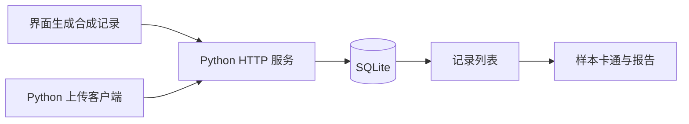

# 系统结构

本仓库包含一个独立运行的演示应用，使用项目的样本可视化和报告展示组件。数据通过本地 HTTP 接口保存到 SQLite，前端读取记录并显示结果。

## 前端

`App.tsx` 管理提交、记录选择和错误提示。`DemoSampleVisual` 将形状、颜色标签映射为插画；标签缺失时保留未知状态。`DemoReportContent` 和 `ChatMessageContent` 负责报告分段及 Markdown 内容展示。

卡通使用观测标签，不在浏览器中运行传感分类。报告内容由接口返回；当前演示服务返回固定文本，并附 `report_source=fixed_fixture`。

## 本地服务

`demo_server.py` 使用 Python 标准库 HTTP 服务和 SQLite。设备 ID 与记录 ID 共同确定一条记录：相同内容重复上传返回已有结果，内容冲突返回 409，原始观测不会被覆盖。

服务只接受示例契约中的合成数据，监听本机回环地址。它不提供生产身份认证；公开占位键仅用于演示请求格式。

## 上传客户端

`reader_device.py` 检查 JSON 和标识字段，先归档原始字节，再上传。客户端不会跟随重定向或自动重试；遇到网络错误时，可以先查询同一条记录的接收状态。命令和完整示例见 [API.md](API.md)。

## 与项目原型的关系

公开应用用于复现记录展示和接口交互。原型中的传感采集、分类、模型调用与 Agent 策略由独立模块承担，本仓库不包含这些实现。将来接入其他服务时，需要单独完成鉴权、数据隔离和协议兼容性验证。
