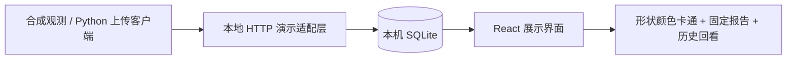

# 公开演示架构

演示不调用线上接口，不需要模型账户。报告文本预先编写且明确标注，输入变化只影响样本展示。Python标准库实现本地服务；React / TypeScript / Vite 实现界面；报告正文由项目现有 Markdown 展示组件渲染。

复用：DemoSampleVisual、DemoReportContent、ChatMessageContent及对应样式和测试；现有设备上传客户端。独立新增：App演示入口、demo_server及集成测试。来源文件摘要见 source-manifest.json，标签措辞统一使用“形状”。

私有系统的模型调用、按任务路由、核心 Agent 策略、传感推理、固件与数据处理实现未包含。它们的存在不能由本演示自动验收。本包展示接口边界与交互，不把固定流程或固定报告称为自主模型决策。

后续外部集成应依赖明确版本的接口契约；不得将此演示的占位键、无身份列表接口或简化验证直接用作生产安全实现。
